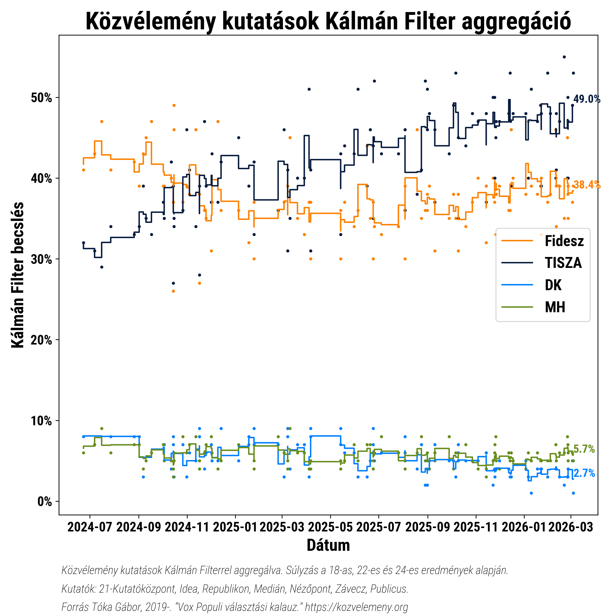
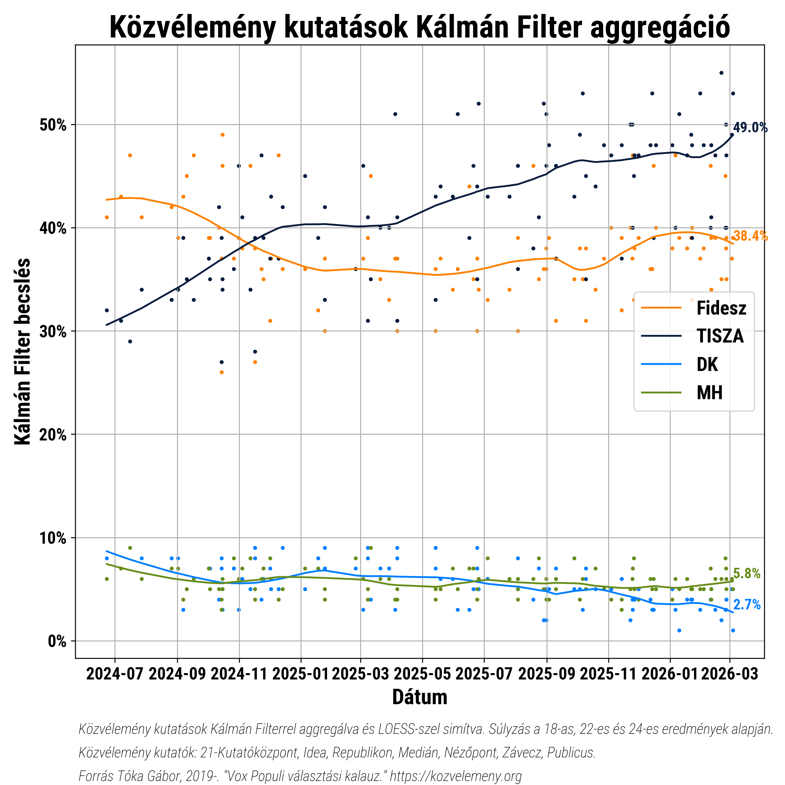

### Hi! 

This small repository features my implementation of a 1D random walk Kalman Filter for Hungarian poll results.

My goal was to try a better estimator of current public opinion results than a simple moving average. I was inspired to use a Kalman Filter by Politico, who uses it for their Poll of Polls results.

As a source of data I rely on Vox Populi. 

I also add weights for pollsters. Weights are calculated based on their past polling performance for the 2024, 2022, 2019 and 2018 elections.

Graphs are created using matplotlib. For smoothing I use LOESS. 

